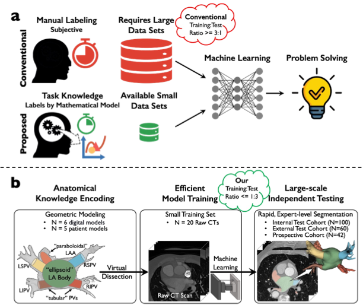

<b>Segmenting Computed Tomograms for Cardiac Ablation Using Machine Learning Leveraged by Domain Knowledge Encoding</b> <br/>
Ruibin Feng<sup>1</sup>, PhD, Brototo Deb<sup>1</sup>, MD, Prasanth Ganesan<sup>1</sup>, PhD, Fleur V.Y. Tjong<sup>1,2</sup>, MD, PhD, Albert J. Rogers<sup>1</sup>, MD, Samuel Ruipérez-Campillo<sup>1,3</sup>, MS, MEng, Sulaiman Somani<sup>1</sup>, MD, Paul Clopton1, MS, Tina Baykaner<sup>1</sup>, MD, Miguel Rodrigo<sup>1,4</sup>, PhD, James Zou<sup>5</sup>, PhD, Francois Haddad<sup>1</sup>, MD, Matei Zahari<sup>6</sup>, PhD, Sanjiv M. Narayan<sup>1</sup>, MD, PhD <br/><br/>
<sup>1 </sup>Department of Medicine and Cardiovascular Institute, Stanford University, Stanford, CA <br/>
<sup>2 </sup>Heart Center, Department of Clinical and Experimental Cardiology, Amsterdam UMC, University of Amsterdam, Amsterdam, The Netherlands <br/>
<sup>3 </sup>Bioengineering Department, University of California, Berkeley, CA <br/>
<sup>4 </sup>CoMMLab, Universitat Politècnica de València, Valencia, Spain <br/>
<sup>5 </sup>Department of Biomedical Data Science, Stanford University, Stanford, CA <br/>
<sup>6 </sup>Department of Computer Science, Stanford University, Stanford, CA <br/>

<p align="center"></p>

<!-- 

This repository provides the official implementation of training Models Genesis as well as the usage of the pre-trained Models Genesis in the following paper:

<b>Models Genesis: Generic Autodidactic Models for 3D Medical Image Analysis</b> <br/>
[Zongwei Zhou](https://www.zongweiz.com/)<sup>1</sup>, [Vatsal Sodha](https://github.com/vatsal-sodha)<sup>1</sup>, [Md Mahfuzur Rahman Siddiquee](https://github.com/mahfuzmohammad)<sup>1</sup>,  <br/>
[Ruibin Feng](https://chs.asu.edu/ruibin-feng)<sup>1</sup>, [Nima Tajbakhsh](https://www.linkedin.com/in/nima-tajbakhsh-b5454376/)<sup>1</sup>, [Michael B. Gotway](https://www.mayoclinic.org/biographies/gotway-michael-b-m-d/bio-20055566)<sup>2</sup>, and [Jianming Liang](https://chs.asu.edu/jianming-liang)<sup>1</sup> <br/>
<sup>1 </sup>Arizona State University,   <sup>2 </sup>Mayo Clinic <br/>
International Conference on Medical Image Computing and Computer Assisted Intervention (MICCAI), 2019 <br/>
<b>[Young Scientist Award](http://www.miccai.org/about-miccai/awards/young-scientist-award/)</b>  <br/>
[paper](http://www.cs.toronto.edu/~liang/Publications/ModelsGenesis/MICCAI_2019_Full.pdf) | [code](https://github.com/MrGiovanni/ModelsGenesis) | [slides](https://docs.wixstatic.com/ugd/deaea1_c5e0f8cd9cde4c3db339d866483cbcd3.pdf) | [poster](http://www.cs.toronto.edu/~liang/Publications/ModelsGenesis/Models_Genesis_Poster.pdf) | talk ([YouTube](https://youtu.be/5W_uGzBloZs), [YouKu](https://v.youku.com/v_show/id_XNDM5NjQ1ODAxMg==.html?sharefrom=iphone&sharekey=496e1494c76ed263653aa3aada61c23e6)) | [blog](https://zhuanlan.zhihu.com/p/86366534)

<b>Models Genesis</b> <br/>
[Zongwei Zhou](https://www.zongweiz.com/)<sup>1</sup>, [Vatsal Sodha](https://github.com/vatsal-sodha)<sup>1</sup>, [Jiaxuan Pang](https://github.com/MRJasonP)<sup>1</sup>, [Michael B. Gotway](https://www.mayoclinic.org/biographies/gotway-michael-b-m-d/bio-20055566)<sup>2</sup>, and [Jianming Liang](https://chs.asu.edu/jianming-liang)<sup>1</sup> <br/>
<sup>1 </sup>Arizona State University,   <sup>2 </sup>Mayo Clinic <br/>
Medical Image Analysis (MedIA) <br/>
<b>[MedIA Best Paper Award](http://www.miccai.org/about-miccai/awards/medical-image-analysis-best-paper-award/)</b>  <br/>
[paper](https://arxiv.org/pdf/2004.07882.pdf) | [code](https://github.com/MrGiovanni/ModelsGenesis) | [slides](https://d5b3ebbb-7f8d-4011-9114-d87f4a930447.filesusr.com/ugd/deaea1_5ecdfa48836941d6ad174dcfbc925575.pdf) | [graphical abstract](https://ars.els-cdn.com/content/image/1-s2.0-S1361841520302048-fx1_lrg.jpg)

<p float="center">
  
   
</p>

## Available implementation

- keras/
- pytorch/

**&#9733; News: Models Genesis, incorporated with nnU-Net, [rank # 1](https://decathlon-10.grand-challenge.org/evaluation/challenge/leaderboard/) in segmenting liver/tumor and hippocampus.**
- competition/


## Major results from our work

1. **Models Genesis outperform 3D models trained from scratch**
2. **Models Genesis top any 2D approaches, including ImageNet models and degraded 2D Models Genesis**
3. **Models Genesis (2D) offer performances equivalent to supervised pre-trained models**

The par plots presented below are produced by Matlab code in `figures/plotsuperbar.m` and the helper functions in `figures/superbar`. Credit to [superbar](https://github.com/scottclowe/superbar) by Scott Lowe.

<p align="center"></p>

Note that learning from scratch <i>simply</i> in 3D may not necessarily yield performance better than ImageNet-based transfer learning in 2D


## Citation
If you use this code or use our pre-trained weights for your research, please cite our papers:
```
@InProceedings{zhou2019models,
  author="Zhou, Zongwei and Sodha, Vatsal and Rahman Siddiquee, Md Mahfuzur and Feng, Ruibin and Tajbakhsh, Nima and Gotway, Michael B. and Liang, Jianming",
  title="Models Genesis: Generic Autodidactic Models for 3D Medical Image Analysis",
  booktitle="Medical Image Computing and Computer Assisted Intervention -- MICCAI 2019",
  year="2019",
  publisher="Springer International Publishing",
  address="Cham",
  pages="384--393",
  isbn="978-3-030-32251-9",
  url="https://link.springer.com/chapter/10.1007/978-3-030-32251-9_42"
}

@article{zhou2021models,
  title="Models Genesis",
  author="Zhou, Zongwei and Sodha, Vatsal and Pang, Jiaxuan and Gotway, Michael B and Liang, Jianming",
  journal="Medical Image Analysis",
  volume = "67",
  pages = "101840",
  year = "2021",
  issn = "1361-8415",
  doi = "https://doi.org/10.1016/j.media.2020.101840",
  url = "http://www.sciencedirect.com/science/article/pii/S1361841520302048",
}

@phdthesis{zhou2021towards,
  title={Towards Annotation-Efficient Deep Learning for Computer-Aided Diagnosis},
  author={Zhou, Zongwei},
  year={2021},
  school={Arizona State University}
}
```


## Acknowledgement
This research has been supported partially by ASU and Mayo Clinic through a Seed Grant and an Innovation Grant, and partially by the National Institutes of Health (NIH) under Award Number R01HL128785. The content is solely the responsibility of the authors and does not necessarily represent the official views of the NIH. This work has utilized the GPUs provided partially by the ASU Research Computing and partially by the Extreme Science and Engineering Discovery Environment (XSEDE) funded by the National Science Foundatio -->n (NSF) under grant number ACI-1548562. This is a patent-pending technology.
