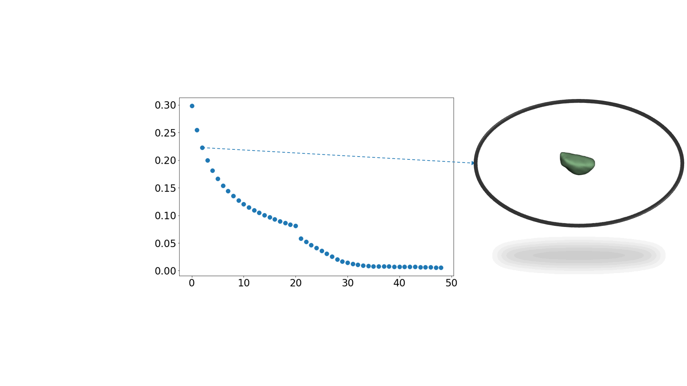

# Segmenting Computed Tomograms for Cardiac Ablation Using Machine Learning Leveraged by Domain Knowledge Encoding
By Ruibin Feng1, PhD, Brototo Deb1, MD, Prasanth Ganesan1, PhD, Fleur V.Y. Tjong1,2, MD, PhD, Albert J. Rogers1, MD, Samuel Ruipérez-Campillo1,3, MS, MEng, Sulaiman Somani1, MD, Paul Clopton1, MS, Tina Baykaner1, MD, Miguel Rodrigo1,4, PhD, James Zou5, PhD, Francois Haddad1, MD, Matei Zahari6, PhD, Sanjiv M. Narayan1, MD, PhD   
1 Department of Medicine and Cardiovascular Institute, Stanford University, Stanford, CA  
2 Heart Center, Department of Clinical and Experimental Cardiology, Amsterdam UMC, University of Amsterdam, Amsterdam, The Netherlands  
3 Bioengineering Department, University of California, Berkeley, CA  
4 CoMMLab, Universitat Politècnica de València, Valencia, Spain  
5 Department of Biomedical Data Science, Stanford University, Stanford, CA  
6 Department of Computer Science, Stanford University, Stanford, CA  

## Virtual Dissection - Erosion

## Virtual Dissection - Dilation

